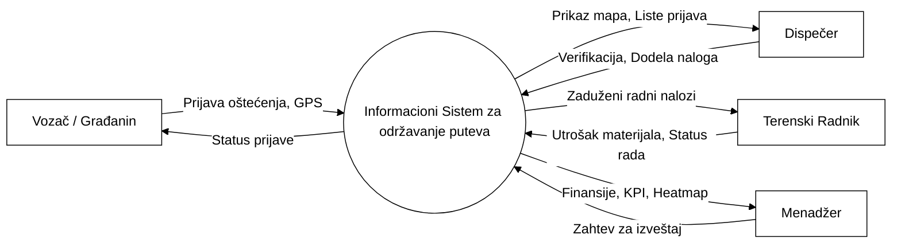
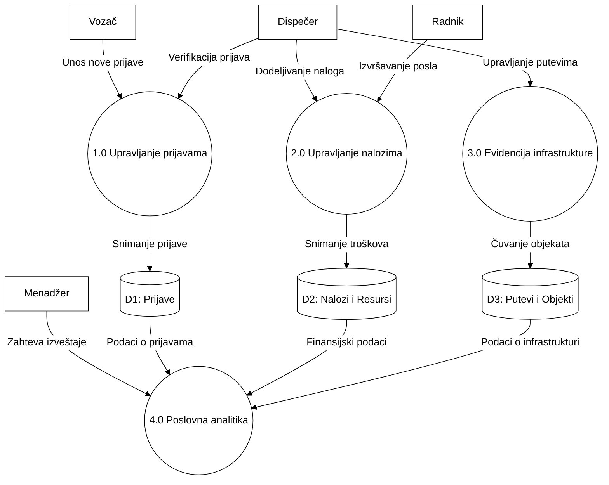
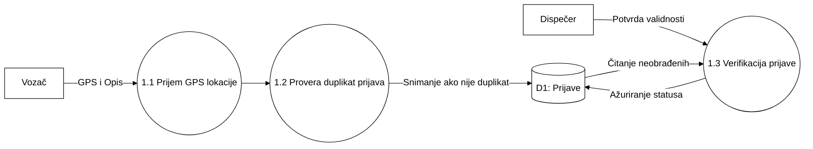
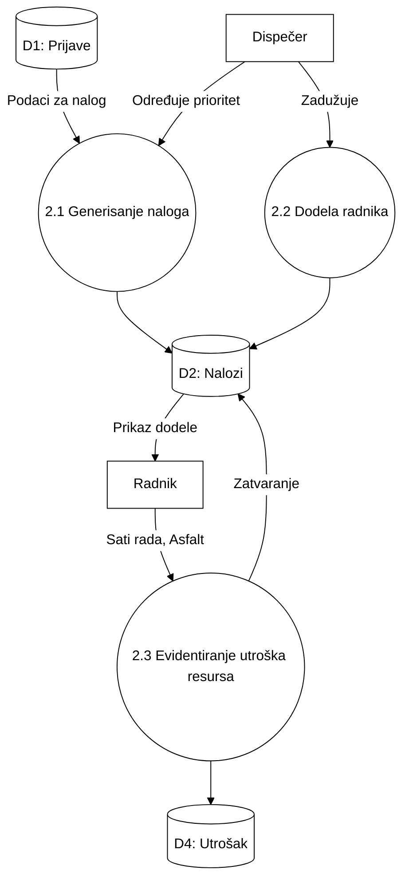
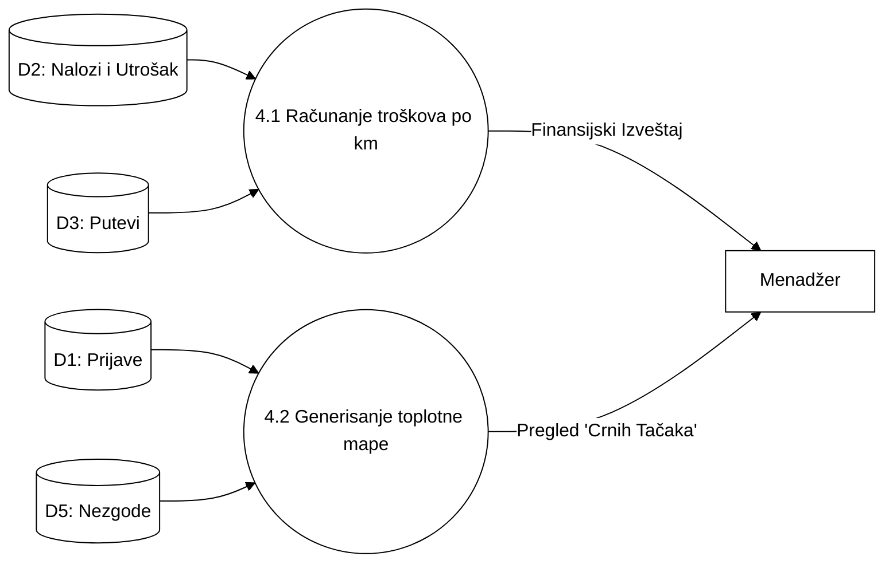
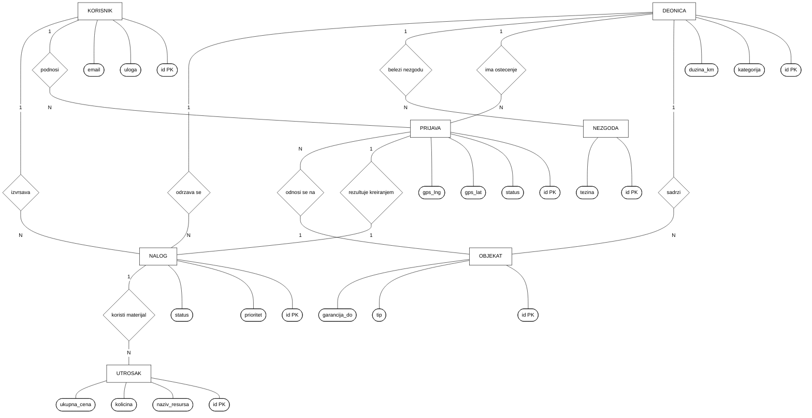

# DRŽAVNI UNIVERZITET U NOVOM PAZARU

## INFORMACIONI SISTEMI
### - DOKUMENTACIJA PROJEKTA -

**INFORMACIONI SISTEM ZA ODRŽAVANJE PUTNE INFRASTRUKTURE I SAOBRAĆAJNE SIGNALIZACIJE**
Haris Muslic
**Novi Pazar, 2026.**

---

## SADRŽAJ

1. Korisnički zahtev
2. Strukturna sistemska analiza – SSA
   2.1. Dijagram konteksta
   2.2. Prvi nivo dekompozicije
   2.3. Drugi nivo dekompozicije
      2.3.1. Upravljanje prijavama oštećenja
      2.3.2. Upravljanje radnim nalozima i resursima
      2.3.3. Generisanje analitičkih izveštaja
3. Rečnik podataka
   3.1. Korisnik
   3.2. Deonica
   3.3. Objekat
   3.4. Prijava
   3.5. Nalog
   3.6. Utrošak
   3.7. Nezgoda
4. EER model
5. Relacioni model

---

## 1. Korisnički zahtev

**1. Upravljanje korisničkim ulogama i pristupom:**
*   Sistem koristi unapred definisane korisničke naloge (bez javne registracije).
*   Jasna podela na četiri uloge: Vozač (građanin), Terenski radnik, Dispečer, Menadžer. Svaka uloga ima svoj specifičan kontrolni panel (Dashboard).

**2. Evidencija putne infrastrukture i deonica:**
*   Unos deonica puta (dužina, kategorija, tip asfalta, GPS početka i kraja).
*   Evidentiranje infrastrukturnih objekata (znakovi, semafori, mostovi) uz tačne GPS koordinate, datum postavljanja i period garancije.

**3. Upravljanje prijavama oštećenja:**
*   Mogućnost vozača da na interaktivnoj mapi prijavi problem (udarna rupa, oboren znak).
*   Sistem detekcije duplikata u radijusu od 50m.
*   Praćenje statusa prijave (Prijavljeno, Verifikovano, Nalog izdat, Sanirano).

**4. Upravljanje radnim nalozima i terenskim radom:**
*   Verifikacija prijava od strane dispečera i njihovo pretvaranje u radne naloge.
*   Automatsko dodeljivanje najvišeg prioriteta ("Kritično") za oštećenja na autoputevima.
*   Kreiranje redovnih i vanrednih naloga za terenske radnike.

**5. Evidencija utroška resursa (materijala i mehanizacije):**
*   Pri zatvaranju naloga, radnik unosi tačne količine utrošenog asfalta, znakova, kao i sate rada kamiona i bagera.
*   Sistem automatski izračunava ukupnu cenu intervencije.

**6. Generisanje izveštaja (Menadžerski panel):**
*   Generisanje izveštaja o ukupnim troškovima po kilometru puta.
*   Praćenje godišnjeg budžeta za održavanje.
*   Toplotna mapa oštećenja i saobraćajnih nezgoda (Black spots).

---

## 2. Strukturna sistemska analiza – SSA

### 2.1. Dijagram konteksta

### 2.2. Prvi nivo dekompozicije

### 2.3. Drugi nivo dekompozicije

#### 2.3.1. Upravljanje prijavama oštećenja

#### 2.3.2. Upravljanje radnim nalozima i resursima

#### 2.3.3. Generisanje analitičkih izveštaja (Menadžment)

---

## 3. Rečnik podataka

### 3.1. Korisnik
Korisnik `<id, ime, email, sifra, uloga>`
| Polje | Tip podatka | Ograničenje |
|---|---|---|
| id | integer | Not null, jedinstveno, PK |
| ime | varchar(50) | Not null |
| email | varchar(100) | Not null, jedinstveno, email format |
| sifra | varchar(255) | Not null |
| uloga | varchar(20) | Not null (vozac/radnik/dispecer/menadzer) |

### 3.2. Deonica
Deonica `<id, naziv, kategorija, duzina_km, tip_asfalta, status>`
| Polje | Tip podatka | Ograničenje |
|---|---|---|
| id | integer | Not null, PK |
| naziv | varchar(100) | Not null |
| kategorija | varchar(20) | Not null (lokalni/magistralni/autoput) |
| duzina_km | decimal(8,2) | Not null, > 0 |
| status | varchar(20) | Not null |

### 3.3. Objekat (Infrastruktura)
Objekat `<id, tip, gps_lat, gps_lng, deonica_id, garancija_do>`
| Polje | Tip podatka | Ograničenje |
|---|---|---|
| id | integer | Not null, PK |
| tip | varchar(50) | Not null (semafor, znak, bankina...) |
| gps_lat | decimal(10,8) | Not null |
| deonica_id | integer | FK -> Deonica |

### 3.4. Prijava
Prijava `<id, korisnik_id, deonica_id, opis, gps_lat, gps_lng, status, datum_prijave>`
| Polje | Tip podatka | Ograničenje |
|---|---|---|
| id | integer | Not null, PK |
| korisnik_id | integer | FK -> Korisnik |
| status | varchar(20) | Not null (prijavljeno, verifikovano...) |

### 3.5. Nalog
Nalog `<id, prijava_id, radnik_id, deonica_id, opis, prioritet, status, kreirano_u>`
| Polje | Tip podatka | Ograničenje |
|---|---|---|
| id | integer | Not null, PK |
| radnik_id | integer | FK -> Korisnik |
| prioritet | varchar(20) | normalan, visok, kritican |

### 3.6. Utrošak
Utrošak `<id, nalog_id, naziv_resursa, kolicina, cena_po_jedinici, ukupna_cena>`
| Polje | Tip podatka | Ograničenje |
|---|---|---|
| id | integer | Not null, PK |
| nalog_id | integer | FK -> Nalog |
| kolicina | decimal(8,2) | Not null, > 0 |

---

## 4. EER model (Entiteti i Relacije)

---

## 5. Relacioni model

*   **Korisnici** (<u>id</u>, ime, email, lozinka, uloga, created_at)
*   **Deonice** (<u>id</u>, naziv, kategorija, duzina_km, tip_asfalta, status, start_lat, start_lng, end_lat, end_lng)
*   **Infrastruktura** (<u>id</u>, tip, status, gps_lat, gps_lng, svojstva_json, <i>deonica_id</i>, ugradjeno, garancija_do)
*   **Prijave** (<u>id</u>, tip_problema, opis, gps_lat, gps_lng, fotografija, status, <i>korisnik_id</i>, <i>deonica_id</i>, prijavljeno_u)
*   **Nalozi** (<u>id</u>, tip, prioritet, status, opis, <i>prijava_id</i>, <i>deonica_id</i>, <i>radnik_id</i>, kreirano_u, zavrseno_u)
*   **Resursi_Utrosak** (<u>id</u>, <i>nalog_id</i>, tip_resursa, naziv_resursa, kolicina, cena_po_jedinici, ukupna_cena, zabelezeno_u)
*   **Nezgode** (<u>id</u>, opis, tezina, gps_lat, gps_lng, <i>deonica_id</i>, prijavljeno_u)
